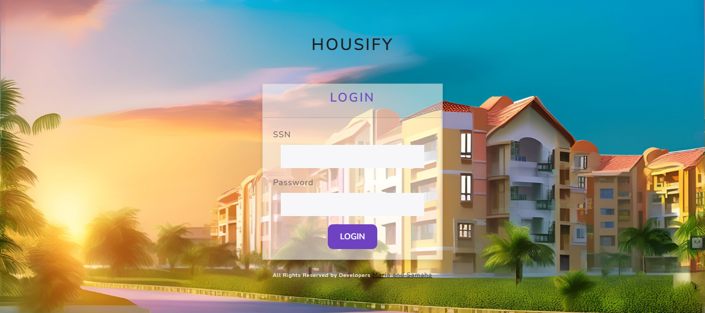

# housify

### Work Division
#### - Samaha:
- Backend development.
- Establishing the connection between Frontend and Backend.
- Designing the relational schema.
#### - Maria:
- Frontend development.
- Creation of the database.
#### - Laiba:
- Creating the ERD (Entity-Relationship Diagram).

